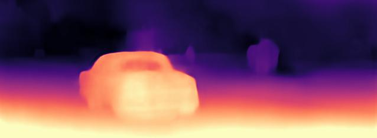

# Monodepth2-PaddlePaddle

## 1. 简介

Monodepth2是通过自监督学习进行单目深度估计的一种方法，发表于ICCV2019，是发表于CVPR2017的Monodepth的升级版。Monodepth基于标定过的双目图像，通过预测中间变量disparity(视差)来对一侧图像进行变换重构另一侧图像，并以重构损失进行训练。Monodepth在此基础上加入了近几年比较流行的单目序列自监督方法，即通过预测单目相邻帧之间的位姿变换与深度图来重构相邻帧。Monodepth2将两种训练方式统一到了基于一个位姿变换的框架下，框架中包含两个网络，一个是深度预测网络，给定一张图片，预测深度图；一个是位姿变换预测网络，给定一对图片，预测两者之间的位姿变换；给定深度图和位姿变换即可重构图像计算损失。

除此之外，Monodepth2引入了一些新trick来提升性能：
- 使用resnet预训练模型，极为显著地提升性能。
- 对于每个像素点，计算由不同视角进行重构所产生误差的最小值作为loss，使得loss对于受遮挡的物体更加鲁棒。
- 将不同尺度的视差图resize到原始尺寸对原图进行，显著降低了深度图中不合理的纹理特性。
- 自动mask掉会动的物体，使得收到监督的像素都满足静态场景的假设。

综合这些trick，Monodepth2得到了当时自监督深度估计的SOTA效果，但仍然与监督方法有着一定差距。

以下为本项目模型在KITTI测试图像上的预测结果：





**论文:** [Digging Into Self-Supervised Monocular Depth Estimation](https://arxiv.org/abs/1806.01260)

**参考repo:** [monodepth2](https://github.com/nianticlabs/monodepth2)

在此非常感谢`@mdfirman`、`@mrharicot`等人贡献的[nomodepth2](https://github.com/nianticlabs/monodepth2)，提高了本repo复现论文的效率。

**aistudio体验教程:** [地址](https://aistudio.baidu.com/aistudio/projectdetail/3399869)

## 2. 数据集

[KITTI](http://www.cvlibs.net/datasets/kitti/)是一个自动驾驶领域常用的数据集，其由配置了传感器的汽车于德国卡尔斯鲁厄采集，数据中包含了双目彩色图像、深度图像、雷达点云等传感数据，并提供目标检测、实例分割等常见CV任务的标签。本项目使用AI Studio上的KITTI压缩数据集，全部数据可从[此处](https://aistudio.baidu.com/aistudio/datasetdetail/15348)下载。在训练过程中只需要双目图像，所以只解压`jpg_images.tar.*`即可。

KITTI数据集存在两种划分，一种是官方标准划分，称为KITTI划分，另一种是Eigen et. al.提出的Eigen划分方式。领域内更常用Eigen划分进行评估。由于在评估时需要点云数据来计算深度图的groundtruth，解压全部点云数据集占用硬盘空间过大，我们对Eigen划分的测试集进行了单独的打包，可在[此处](https://aistudio.baidu.com/aistudio/datasetdetail/124009)下载。

本地运行代码的同学需自行下载两个数据集进行解压。

## 3. 复现精度

首先训练输入分辨率为640x192的模型：加载resnet18预训练模型，batch size 12，epoch 20，优化器Adam，初始学习率1e-4，15个epoch后减小为1e-5。原文和仓库并没有提供最优模型的选择方法，我们保存验证集loss最低的模型为最优模型。此时得到的最优模型abs_rel为0.109，未达到验收精度。

之后将以640x192为输入分辨率的最优模型在1024x320的输入分辨率上进行finetune，batch size 4，epoch 2，优化器Adam，学习率5e-5。得到的模型abs_rel为0.104，达到验收标准。

**注意：**为了固定数据增强的随机性，项目中使用setup_seed对Dataloader中的所有worker进行了初始化，这就导致了结果是和worker的数量相关的，想要完全复现项目中的结果，第一部分训练的num_workers=16，第二部分训练的num_workers=4。

|                  |  abs_rel  |  sq_rel  |   rms   |  log_rms  |   a1    |   a2    |   a3    |
|------------------|-----------|----------|---------|-----------|---------|---------|---------|
|640  x 192 原文精度|   0.106   |  0.818   |  4.750  |   0.196   |  0.874  |  0.957  |  0.979  |
|1024 x 320 原文精度|   0.106   |  0.806   |  4.630  |   0.193   |  0.876  |**0.958**|**0.980**|
|640  x 192 复现精度|   0.109   |  0.880   |  4.903  |   0.200   |  0.868  |  0.955  |  0.979  |
|1024 x 320 复现精度| **0.104** |**0.798** |**4.619**| **0.192** |**0.879**|**0.958**|**0.980**|

训练日志链接：[640x192 train log](logs/train-640x192.log), [1024x320 finetune log](logs/city2eigen.log), [640x192 test log](logs/test-640x192.log), [1024x320 test log](logs/test-1024x320.log)
权重文件链接：[pytorch resent18 pretrained weight](https://github.com/IcarusWizard/monodepth-paddle/releases/download/v0.1/resnet18_pytorch.h5), [our best 640x192 weights](https://github.com/IcarusWizard/monodepth-paddle/releases/download/v0.1/best_640x192.zip), [our best 1024x320 weights](https://github.com/IcarusWizard/monodepth-paddle/releases/download/v0.1/best_1024x320.zips)

## 4. 快速开始

### 准备环境
- 硬件：CPU or GPU
- 框架：
  - python>=3.7
  - PaddlePaddle=2.2.1

首先根据机器情况安装paddlepaddle，对于需要训练的同学**强烈建议使用GPU**。对于有GPU的机器使用`pip install paddlepaddle-gpu==2.2.1`，对于没有GPU的机器使用`pip install paddlepaddle==2.2.1`。更多安装方式可以参考[PaddlePaddle官网](https://www.paddlepaddle.org.cn/)。

在安装完PaddlePaddle之后，直接使用`pip install -r requirements.txt`安装其他依赖。

#### 训练
```
# train the model at resolution of 640 x 192
python train.py --model_name mono+stereo_model_640x192 --frame_ids 0 -1 1 --use_stereo \ 
    --data_path <path to your kitti dataset> --weights_init <path to pytorch resnet18 weight> \
    --log_dir logs --num_workers 4

# finetune the best 640 x 192 model at resolution of 1024 x 320
python train.py --model_name mono+stereo_model_1024x320 --frame_ids 0 -1 1 --use_stereo \
    --data_path <path to your kitti dataset> --height 320 --width 1024 \
    --load_weights_folder <path to the best 640x192 models> \
    --log_dir logs --num_workers 4 --batch_size 4 --num_epochs 1 --learning_rate 5e-5
```

#### 评估
```
# generate groundtruth
python export_gt_depth.py --data_path kitti_data --split eigen

# evaluate model
python evaluate_depth.py --load_weights_folder <path to the folder of weight files> --eval_stereo --data_path <path to KITTI Eigen Test>
```

#### Demo
项目同时提供以单帧图像为输入的demo，直接预测视差图，命令如下：
`python demo.py --image_path <path to the test image> --load_weights_folder <path to the weights>`

**注意：**预测得到的结果为视差图d，真正的深度图D=k/d，其中k为某与相机相关的常数，需要深度图的同学可以针对自己的问题手动调整这个常数得到合理的深度图。

## 5. 代码结构

```
├── assets # demo图像
├── datasets # 数据集定义
├── logs # 日志文件夹
├── network # 网络定义
├── splits # 数据集数据划分文件
├── weights # 存放权重文件
├── LICENSE
├── README.md
├── demo.py # 单张图像深度估计脚本
├── evalute_depth.py # 测试脚本
├── export_gt_depth.py # 计算groundtruth
├── kitti_utils.py # 与KITTI数据集相关的功能函数
├── layers.py # 基础模块定义
├── options.py # 超参数定义
├── trainer.py # 训练方式定义
├── train.py # 训练入口脚本
├── requirements.txt # 依赖包
└── utils.py # 功能函数
```

## 6. 复现心得
需要注意的细节：
- `paddle.grid_sample`的反向传播存在Bug，当`grid.stop_gradient=False`时，`x.stop_gradient`必须为`False`，否则会报错，已提交PaddlePaddle [issue](https://github.com/PaddlePaddle/Paddle/issues/38900)。
- Paddle Hub中的Resnet预训练参数与PyTorch Hub的不同，使用Paddle的预训练参数在640x192上训练最好只能达到0.113，加载PyTorch的预训练模型可达到0.109。